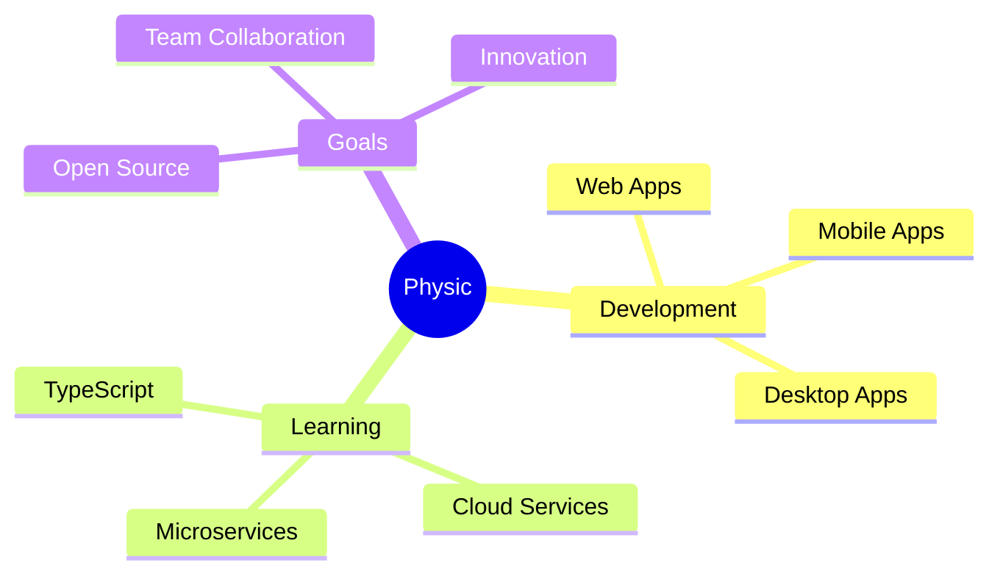

<div align="center">
  
</div>

<div align="center">
  <a href="https://git.io/typing-svg">
    
  </a>
</div>

<div align="center">
  

[](https://github.com/iphysicc)
[](https://github.com/iphysicc)

</div>

<br>


## 👨‍💻 About Me


```javascript
const Physic = {
    realName: "Mert",
    nickname: "Physic",
    role: "Full Stack Developer",
    location: "Digital Universe 🌌",
    experience: "Building innovative solutions",
    technologies: {
        frontend: ["React", "Next.js", "HTML5", "CSS3", "JavaScript"],
        backend: ["Node.js", "Python", "C#", "Express"],
        desktop: ["Electron.js", "Tauri"],
        mobile: ["Java", "Android"],
        databases: ["MongoDB", "MySQL", "SQLite"],
        tools: ["Git", "Docker", "AWS"]
    },
    currentFocus: "Building scalable Web, Mobile & Desktop apps",
    learning: ["TypeScript", "React Native", "Cloud Architecture"],
    passions: ["Clean Code", "Problem Solving", "Innovation", "Open Source"],
    funFact: "I debug with console.log() and I'm proud of it! 🐛",
    motto: "Code with passion, debug with patience 🚀",
    availableForWork: true
};
```

<br>

### ⚡ Quick Facts

- 🔭 Currently working on exciting cross-platform projects
- 🌱 Learning advanced cloud technologies and microservices
- 👯 Looking to collaborate on open source projects
- 💬 Ask me about Web, Mobile, or Desktop development
- 📫 Reach me on Discord for collaboration
- ⚙️ I use daily: `.js`, `.py`, `.cs`, `.java`


## 🛠️ Tech Stack & Skills

<div align="center">

### 💻 Languages


### 🚀 Frameworks & Libraries


### 🗄️ Databases


### 🛠️ Tools & Services


</div>


## 💻 Development Environment

<div align="center">

### 🖥️ IDEs & Editors


### 💿 Operating Systems


</div>


## 🎯 Current Focus & Learning

<div align="center">



</div>


## 📊 GitHub Statistics

<div align="center">
  
</div>

<div align="center">
  
  
</div>

<div align="center">
  
  
</div>

<div align="center">
  
</div>


## 🏆 Achievements & Highlights

<div align="center">

| 🎯 Metric | 📊 Value |
|-----------|----------|
| 💻 Years of Coding | Growing |
| 🚀 Projects Completed | Multiple |
| 🌟 GitHub Stars | Counting |
| 🤝 Contributions | Active |
| 📚 Repositories | Various |

</div>


## 🌐 Connect With Me

<div align="center">

[](https://discord.gg/fwey6Gjkwe)
[](https://github.com/iphysicc)
[](#)

</div>

<div align="center">
  
</div>

<div align="center">
  
### 💭 Dev Quote


</div>

<div align="center">
  
</div>

<div align="center">

### 🐍 Contribution Snake


</div>

<div align="center">
  
</div>

## 💖 Support My Work

<div align="center">

If you like what I do, maybe consider buying me a coffee/tea 🥺👉👈

<a href="https://www.buymeacoffee.com/yourusername" target="_blank">
  
</a>

</div>

<div align="center">
  
</div>

<div align="center">
  
### Show some ❤️ by starring some of the repositories!

</div>
